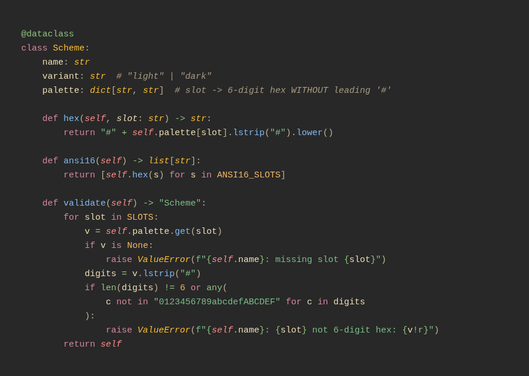

# wana.nvim


A warm, bookish Gruvbox-leaning Neovim colorscheme with dark + light variants.
The palette is generated from the canonical [Wana](https://github.com/atalariq/wana)
base24 schemes; highlights are hand-authored.



## Palette

| variant   | bg                                                | red                                               | orange                                            | yellow                                            | green                                             | cyan                                              | blue                                              | magenta                                           | fg                                                |
| --------- | ------------------------------------------------- | ------------------------------------------------- | ------------------------------------------------- | ------------------------------------------------- | ------------------------------------------------- | ------------------------------------------------- | ------------------------------------------------- | ------------------------------------------------- | ------------------------------------------------- |
| **dark**  |  |  |  |  |  |  |  |  |  |
| **light** |  |  |  |  |  |  |  |  |  |

## Install (lazy.nvim)

```lua
{ "atalariq/wana.nvim", priority = 1000, config = function()
  vim.o.background = "dark" -- or "light"
  vim.cmd.colorscheme("wana")
end }
```

## Variants

`set background=dark` / `set background=light` selects the variant, then
`:colorscheme wana`.

## lualine

```lua
require("lualine").setup({ options = { theme = "wana" } })
```

> `lua/wana/palette.lua` is generated — do not hand-edit. Edit highlights in
> `lua/wana/highlights.lua`. Source of truth: `schemes/` in atalariq/wana.
